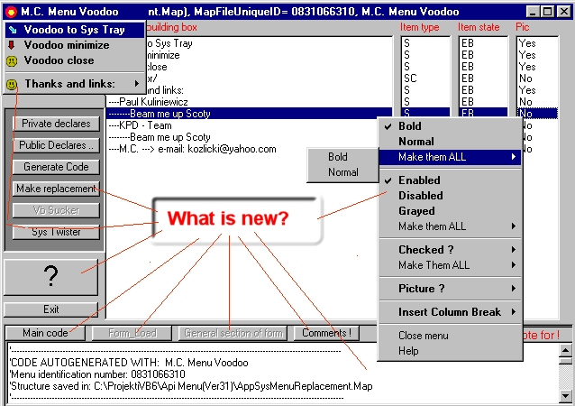



## M\.C menu Voodoo

### Description

It is the successor of nov. 2000 contest winner Mc API menu code generator. The shortest description would be - you seen nothing yet. Some of new things. Super FAST coding, Sys menu manipulation, Inporting structures from VB frm-s, Reoplacing existing codes, hlp file and more, more,more. Do vote.
 
### More Info
 

             |
---                |---
**Submitted On**   |2001-01-03 13:14:52
**By**             |[M\.C](https://github.com/Planet-Source-Code/PSCIndex/blob/master/ByAuthor/m-c.md)
**Level**          |Advanced
**User Rating**    |4.6 (78 globes from 17 users)
**Compatibility**  |VB 6\.0
**Category**       |[Complete Applications](https://github.com/Planet-Source-Code/PSCIndex/blob/master/ByCategory/complete-applications__1-27.md)
**World**          |[Visual Basic](https://github.com/Planet-Source-Code/PSCIndex/blob/master/ByWorld/visual-basic.md)
**Archive File**   |[CODE\_UPLOAD13317132001\.zip](https://github.com/Planet-Source-Code/m-c-m-c-menu-voodoo__1-14074/archive/master.zip)

